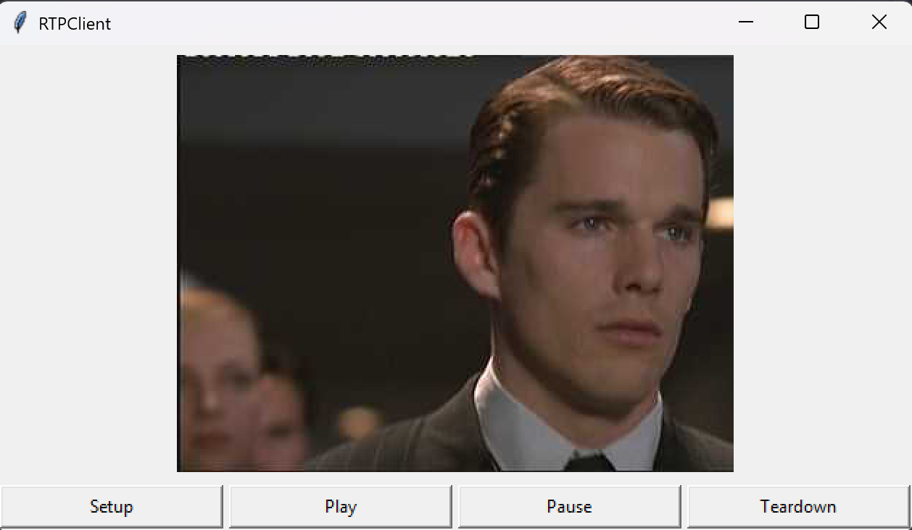

# socket-programming-for-video-streaming


A simple client-server application for real-time video streaming using sockets.

## Demo



## Table of Contents

- [Features](#features)
- [Prerequisites](#prerequisites)
- [Installation](#installation)
- [Usage](#usage)
  - [Running the Server](#1-start-the-server)
  - [Running the Client](#2-start-the-client)
- [Project Structure](#project-structure)
- [Protocol Details](#protocol-details)
  - [RTSP](#rtsp-real-time-streaming-protocol)
  - [RTP](#rtp-real-time-transport-protocol)
  - [Flow Diagram](#flow-diagram)
- [Contributing](#contributing)
- [Acknowledgments](#acknowledgments)

## Features

The application supports standard media control operations:
* **SETUP**: Initialize the session and transport method.
* **PLAY**: Start receiving video frames from the server.
* **PAUSE**: Temporarily stop the video stream.
* **TEARDOWN**: Terminate the session and close the socket connection.

## Prerequisites

Before running the application, ensure you have the following installed:

- **[Python](https://www.python.org/)**

- **Pillow** (Python Imaging Library)
```bash
pip install Pillow
# or for some environment
pip3 install Pillow
```

## Installation
1. Clone the Repostory
```bash
git clone https://github.com/felixcodin/socket-programming-for-video-streaming.git
```
2. Navigate to the Directory
```bash
cd socket-programming-for-video-streaming
```

## Usage
To use the application, you need to run the server component first, followed by the client.

### 1. Start the Server

The server listens for incoming connections and streams the video file.
```bash
# Syntax: python Server.py [sever_port]
python Server.py 8554
```
### 2. Start the Client

The client connects to the server and opens the GUI for video control.

```bash
# Syntax: python Client.py [localhost] [server_port] [RTP_port] [video_filename]
python ClientLauncher.py 127.0.0.1 8554 25000 movie.Mjpeg
```

### 3. Close the Server

Press `Ctrl + C` to close the server.

## Project Structure

```Plaintext
socket-programming-for-video-streaming/
│
├── Client.py              # Client implementation with GUI (Tkinter)
├── ClientLauncher.py      # Client entry point and argument parser
├── Server.py              # Server main process - listens for RTSP connections
├── ServerWorker.py        # Worker thread to handle each client session
├── RtpPacket.py           # RTP packet encoder/decoder (RFC 3550)
├── VideoStream.py         # Helper class to read MJPEG video frames
│
├── movie.Mjpeg            # Sample video file in Motion JPEG format
├── cache-*.jpg            # Temporary cache files (auto-generated)
│
├── README.md              # Project documentation
└── .devcontainer/         # VS Code dev container configuration
    └── devcontainer.json
```

### File Description

| File | Description |
|------|-------------|
| **Client.py** | Implements RTSP client with GUI controls (Setup, Play, Pause, Teardown). Handles RTSP signaling and RTP packet reception |
| **ClientLauncher.py** | Entry point for client application. Parses command-line arguments and launches GUI |
| **Server.py** | Main server process. Creates TCP socket for RTSP signaling and spawns worker threads |
| **ServerWorker.py** | Handles individual client sessions. Processes RTSP requests and sends RTP packets via UDP |
| **RtpPacket.py** | RTP packet implementation following RFC 3550. Encodes/decodes RTP headers and payload |
| **VideoStream.py** | Reads MJPEG video file frame by frame. Parses frame length and extracts JPEG data |

## Protocol Details

### RTSP (Real-Time Streaming Protocol)
- **Transport**: TCP (default port 8554)
- **Purpose**: Session control and signaling
- **Messages**: SETUP, PLAY, PAUSE, TEARDOWN

### RTP (Real-Time Transport Protocol)
- **Transport**: UDP (client-specified port)
- **Purpose**: Media data transmission
- **Payload Type**: 26 (MJPEG)

### Flow Diagram

```
Client                    Server
  |                          |
  |--- SETUP (TCP) --------->|
  |<-- 200 OK ---------------|
  |                          |
  |--- PLAY (TCP) ---------->|
  |<-- 200 OK ---------------|
  |<== RTP Packets (UDP) ====|
  |                          |
  |--- PAUSE (TCP) --------->|
  |<-- 200 OK ---------------|
  |                          |
  |--- TEARDOWN (TCP) ------>|
  |<-- 200 OK ---------------|
```

## Contributing
Contributions are welcome! Please follow these steps:

1. Fork the project.
2. Create your feature branch (`git checkout -b feature/AmazingFeature`).
3. Commit your change (`git commit -m 'Add some AmazingFeature'`).
4. Push to the branch (`git push origin feature/AmazingFeature`).
5. Open a Pull Request

## Acknowledgments

- Based on RTSP/RTP protocol specifications (RFC 2326, RFC 3550)
- Sample video format: Motion JPEG (MJPEG)